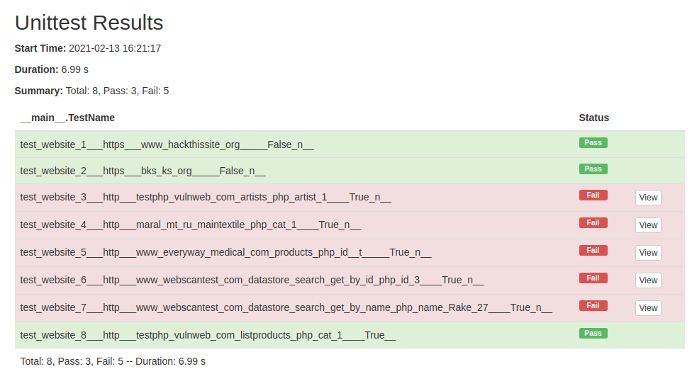

# Faza e trete e projektit nga lenda Siguria ne Internet
## SQL Injection
<br>

### Hyrje

Ky program ben testimin e websites te ndryshem per dobesite e tyre ne siguri, perkatesisht ne SQL Injection. Implementimi i projektit eshte bere me gjuhen programuese Python, duke perdorur modulin e gatshem Tkinter per aplikacionin GUI. Text Editori i perdorur eshte Visual Studio Code.

<br>

### Ekzekutimi

Fillimisht, behet clone projekti nga GitHub me ane te https ose SSH.

<br>

```bash
git clone https://github.com/alinafazliu/sql_injection_test.git
```
Pastaj, hyjme tek root directory i projektit. Per te ekzekutuar projektin duhet te importojme modulet ne vijim.

```python
from bs4 import BeautifulSoup as bs
from urllib.parse import urljoin
import tkinter as tk
import re
import unittest
import HtmlTestRunner
from ddt import ddt, data, unpack
```
Per te importuar cilindo modul duhet te perdorim komanden:
```bash
pip3 install <module>
```
Ne fund per te ekzekutuar programin perdorim komanden:
```bash
python3 main.py
```
<br>

Pamja kryesore e programit pas ekzekutimit te main.py
<br>

<br>
<br>
Pamja e programit pas testimit te nje website.
<br>


### Testimi
Per te testuar programin ekzekutojme file testing.py. Pas ekzekutimit te ketij file, na paraqitet nje html file qe tregon statusin e te gjitha testeve qe gjenden ne file pages.txt

